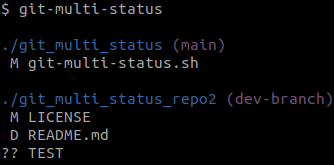

# git_multi_status
Bash script for git that recursively displays changes in all git repositories.



# Usage
Source the script with (can be added to `.bashrc` file)
```
source git-multi-status.sh
```
Show all changes in child directories by executing
```
git-multi-status
```
